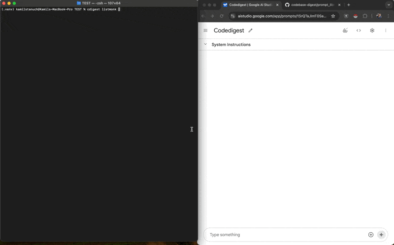

# Codebase Digest

[](https://badge.fury.io/py/codebase-digest)
[](https://opensource.org/licenses/MIT)

Codebase Digest is a command-line tool written in Python that helps you analyze and understand your codebase. It provides a structured overview of your project's directory structure, file sizes, token counts, and even consolidates the content of all text-based files into a single output for easy analysis with Large Language Models (LLMs).



## Table of Contents

- [Features](#features)
- [Installation](#installation)
- [Usage](#usage)
- [Configuration](#configuration)
- [Ignore Functionality](#ignore-functionality)
- [LLM Prompts for Enhanced Analysis](#llm-prompts-for-enhanced-analysis)
- [Contributing](#contributing)
- [License](#license)

## Features

- 📊 **Directory Tree Visualization:** Generate a hierarchical view of your project structure
- 📈 **Codebase Statistics:** Calculate total files, directories, code size, and token counts
- 📄 **File Content Consolidation:** Combine all text-based files into a single output
- 🚫 **Flexible Ignore System:** Support for custom patterns, defaults, and `.gitignore` files
- 🎨 **Multiple Output Formats:** Choose between text, JSON, Markdown, XML, or HTML
- 🌈 **Colored Console Output:** Visually appealing and informative summaries
- 🧠 **LLM Analysis Support:** Comprehensive prompt library for in-depth codebase analysis

## Installation

### Via pip (Recommended)

```bash
pip install codebase-digest
````


### From source

````bash
git clone https://github.com/kamilstanuch/codebase-digest.git
cd codebase-digest
pip install -r requirements.txt
````


## Usage

Basic usage:

````bash
cdigest [path_to_directory] [options]
````


Examples:

1. Analyze a project with default settings:
   ```bash
   cdigest /path/to/my_project
   ```

2. Analyze with custom depth and output format:
   ```bash
   cdigest /path/to/my_project -d 3 -o markdown
   ```

3. Ignore specific files and folders:
   ```bash
   cdigest /path/to/my_project --ignore "*.log" "temp_folder" "config.ini"
   ```

4. Show file sizes and include git directory:
   ```bash
   cdigest /path/to/my_project --show-size --include-git
   ```

5. Analyze and copy output to clipboard:
   ```bash
   cdigest /path/to/my_project --copy-to-clipboard
   ```

## Configuration

| Option | Description |
|--------|-------------|
| `path_to_directory` | Path to the directory you want to analyze |
| `-d, --max-depth` | Maximum depth for directory traversal |
| `-o, --output-format` | Output format (text, json, markdown, xml, or html). Default: text |
| `-f, --file` | Output file name |
| `--show-size` | Show file sizes in directory tree |
| `--show-ignored` | Show ignored files and directories in tree |
| `--ignore` | Patterns to ignore (e.g., '*.pyc' '.venv' 'node_modules') |
| `--keep-defaults` | Keep default ignore patterns when using --ignore |
| `--no-content` | Exclude file contents from the output |
| `--include-git` | Include .git directory in the analysis |
| `--max-size` | Maximum allowed text content size in KB (default: 10240 KB) |
| `--copy-to-clipboard` | Copy the output to clipboard |

## Ignore Functionality

### Default Ignore Patterns

The following patterns are ignored by default:

```python
DEFAULT_IGNORE_PATTERNS = [
'.pyc', '.pyo', '.pyd', 'pycache', # Python
'node_modules', 'bower_components', # JavaScript
'.git', '.svn', '.hg', '.gitignore', # Version control
'venv', '.venv', 'env', # Virtual environments
'.idea', '.vscode', # IDEs
'.log', '.bak', '.swp', '.tmp', # Temporary and log files
'.DS_Store', # macOS
'Thumbs.db', # Windows
'build', 'dist', # Build directories
'.egg-info', # Python egg info
'.so', '.dylib', '.dll' # Compiled libraries
]
```

### Custom Ignore Patterns

You can specify additional patterns to ignore using the `--ignore` option. These patterns will be added to the default ignore patterns unless `--no-default-ignores` is used.

Patterns can use wildcards (* and ?) and can be:
- Filenames (e.g., 'file.txt')
- Directory names (e.g., 'node_modules')
- File extensions (e.g., '*.pyc')
- Paths (e.g., '/path/to/ignore')

Example:
```bash
cdigest /path/to/my_project --ignore ".txt" "temp" "/path/to/specific/file.py"
```


### .cdigestignore File

You can create a `.cdigestignore` file in your project root to specify project-specific ignore patterns. Each line in this file will be treated as an ignore pattern.

### Overriding Default Ignores

To use only your custom ignore patterns without the default ones, use the `--no-default-ignores` option:

```bash
cdigest /path/to/my_project --no-default-ignores --ignore "custom_pattern" "another_pattern"
```


## LLM Prompts for Enhanced Analysis

Codebase Digest includes a comprehensive set of prompts in the `prompt_library` directory to help you analyze your codebase using Large Language Models. These prompts cover various aspects of code analysis and business alignment:

### Use Cases

1. **Codebase Mapping and Learning**: Quickly understand the structure and functionality of a new or complex codebase.
2. **Improving User Stories**: Analyze existing code to refine or generate user stories.
3. **Initial Security Analysis**: Perform a preliminary security assessment.
4. **Code Quality Enhancement**: Identify areas for improvement in code quality, readability, and maintainability.
5. **Documentation Generation**: Automatically generate or improve codebase documentation.
6. **Learning Tool**: Use as a teaching aid to explain complex coding concepts or architectures.
7. **Business Alignment**: Analyze how the codebase supports business objectives.
8. **Stakeholder Communication**: Generate insights to facilitate discussions with non-technical stakeholders.

### Prompt Categories

#### I. Code Quality & Understanding:
- [Codebase Error and Inconsistency Analysis](prompt_library/quality_error_analysis.md): Identify and analyze errors and inconsistencies in the codebase.
- [Codebase Risk Assessment](prompt_library/quality_risk_assessment.md): Evaluate potential risks within the codebase.
- [Codebase Documentation Generation](prompt_library/quality_documentation_generation.md): Automatically generate or improve codebase documentation.

#### II. Learning & Knowledge Extraction:
- [User Story Reconstruction from Code](prompt_library/learning_user_story_reconstruction.md): Reconstruct and structure user stories based on the codebase.
- [Code-Based Mini-Lesson Generation](prompt_library/learning_mini_lesson_generation.md): Create mini-lessons to explain complex coding concepts or architectures.

#### III. Code Improvement & Transformation:
- [Codebase Best Practice Analysis](prompt_library/improvement_best_practice_analysis.md): Analyze the codebase for good and bad programming practices.
- [Codebase Translation to Another Programming Language](prompt_library/improvement_language_translation.md): Translate the codebase from one programming language to another.
- [Codebase Refactoring for Improved Readability and Performance](prompt_library/improvement_refactoring.md): Suggest refactoring improvements for better readability and performance.

#### IV. Testing & Security:
- [Unit Test Generation for Codebase](prompt_library/testing_unit_test_generation.md): Generate unit tests for the provided codebase.
- [Security Vulnerability Analysis of Codebase](prompt_library/security_vulnerability_analysis.md): Identify potential security vulnerabilities in the codebase.

#### V. Business & Stakeholder Analysis:
- [Business Impact Analysis](prompt_library/business_impact_analysis.md): Identify key features and their potential business impact.
- [Stakeholder Persona Generation](prompt_library/stakeholder_persona_generation.md): Infer potential stakeholder personas based on codebase functionalities.
- [Business Model Canvas Analysis](prompt_library/business_model_canvas_analysis.md): Analyze business implications using the Business Model Canvas framework.
- [Value Proposition Canvas Analysis](prompt_library/value_proposition_canvas_analysis.md): Align technical features with user needs and benefits.
- [SWOT Analysis](prompt_library/swot_analysis.md): Evaluate the codebase's current state and future potential.
- [Jobs to be Done (JTBD) Analysis](prompt_library/jobs_to_be_done_analysis.md): Understand core user needs and identify potential improvements.
- [Lean Canvas Analysis](prompt_library/lean_canvas_analysis.md): Evaluate business potential and identify areas for improvement or pivot.
- [OKR (Objectives and Key Results) Analysis](prompt_library/okr_analysis.md): Align codebase features with potential business objectives and key results.
- [Customer Journey Map Analysis](prompt_library/customer_journey_map_analysis.md): Map how different parts support various stages of the user's journey.
- [Value Chain Analysis](prompt_library/value_chain_analysis.md): Understand how the codebase supports the larger value creation process.


For detailed instructions on using these prompts, refer to the individual files in the `prompt_library` directory.

## Contributing

Contributions are welcome! Please feel free to submit a Pull Request.

## License

This project is licensed under the MIT License - see the [LICENSE](LICENSE) file for details.
